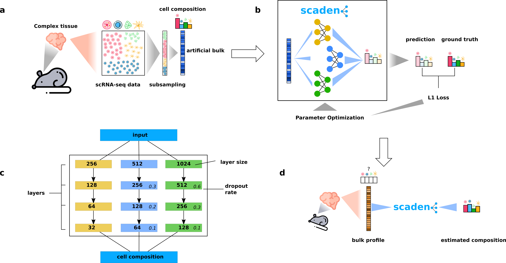

## Single-cell assisted deconvolutional network

Scaden is a deep-learning based algorithm for cell type deconvolution of bulk RNA-seq samples. It was developed 
at the DZNE Tübingen and the ZMNH in Hamburg. 
A pre-print describing the method is available at Biorxiv:
 [Deep-learning based cell composition analysis from tissue expression profiles](https://www.biorxiv.org/content/10.1101/659227v2)

A complete documentation is available [here](https://scaden.readthedocs.io)

Scaden overview. a) Generation of artificial bulk samples with known cell type composition from scRNA-seq data. b) Training 
of Scaden model ensemble on simulated training data. c) Scaden ensemble architecture. d) A trained Scaden model can be used
to deconvolve complex bulk mixtures.

### 1. System requirements
Scaden was developed and tested on Linux (Ubuntu 16.04 and 18.04). It was not tested on Windows or Mac, but should
also be usable on these systems when installing with Pip or Bioconda. Scaden does not require any special
hardware (e.g. GPU), however we recommend to have at least 16 GB of memory.

Scaden requires Python 3. All package dependencies should be handled automatically when installing with pip or conda.

### 2. Installation guide
The recommended way to install Scaden is using conda and the Bioconda channel:

`conda install -c bioconda scaden`

Instllation with conda takes only a few minutes (2-5), depending on the internet connetion.
Alternatively Scaden can be installed with pip:

`pip install scaden`

We also provide a docker image with Scaden installed:
[https://hub.docker.com/r/kevinmenden/scaden](https://hub.docker.com/r/kevinmenden/scaden)

### 3. Demo
We provide several curated [training datasets](https://scaden.readthedocs.io/en/latest/datasets/) for Scaden. For this demo,
we will use the human PBMC training dataset, which consists of 4 different scRNA-seq datasets and 32,000 samples in total.
You can download it here:
[https://figshare.com/s/e59a03885ec4c4d8153f](https://figshare.com/s/e59a03885ec4c4d8153f).

For this demo, you will also need to download some test samples to perform deconvolution on, along with their associated labels.
You can download the data we used for the Scaden paper here:
[https://figshare.com/articles/Publication_Figures/8234030](https://figshare.com/articles/Publication_Figures/8234030)

We'll perform deconvolution on simulated samples from the data6k dataset. You can find the samples and labels in 'paper_data/figures/figure2/data/data6k_500_*'
once you have downloaded this data from the link mentioned above.

The first step is to perform preprocessing on the training data. This is done with the following command:

`scaden process pbmc_data.h5ad paper_data/figures/figure2/data/data6k_500_samples.txt`

This will generate a file called 'processed.h5ad', which we will use for training. The training data
we have downloaded also contains samples from the data6k scRNA-seq dataset, so we have to exclude them from training
to get a meaningfull test of Scaden's performance. The following command will train a Scaden ensemble for 5000 steps per model (recommended),
and store it in 'scaden_model'. Data from the data6k dataset will be excluded from training. Depending on your machine, this can take about 10-20 minutes.

`scaden train processed.h5ad --steps 5000 --model_dir scaden_model --train_datasets 'data8k donorA donorC'`

Finally, we can perform deconvolution on the 500 simulates samples from the data6k dataset:

`scaden predict paper_data/figures/figure2/data/data6k_500_samples.txt --model_dir scaden_model`

This will create a file named 'cdn_predictions.txt' (will be renamed in future version to 'scaden_predictions.txt'), which contains
the deconvolution results. You can now compare these predictions with the true values contained in 
'paper_data/figures/figure2/data/data6k_500_labels.txt'. This should give you the same results as we obtained in the Scaden paper
(see Figure 2).

### 4. Instructions for use
For a general description on how to use Scaden, please check out our [usage documentation](https://scaden.readthedocs.io/en/latest/usage/).